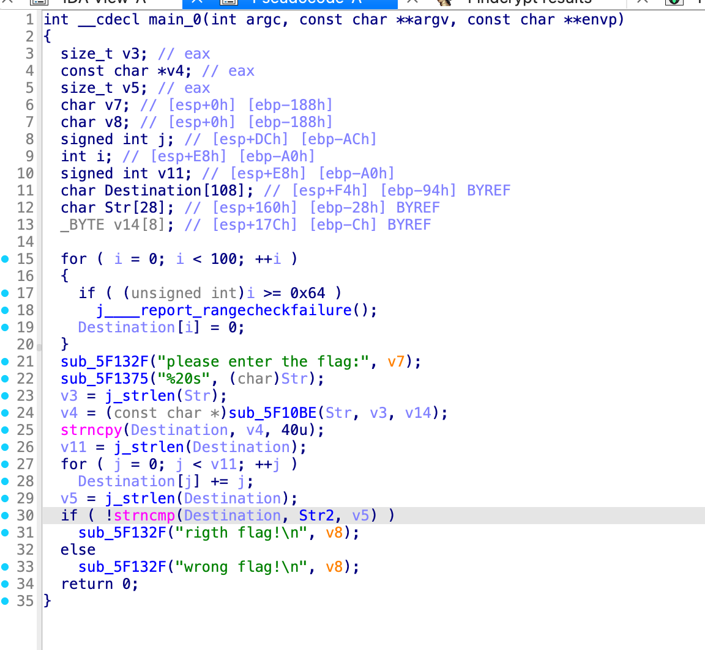
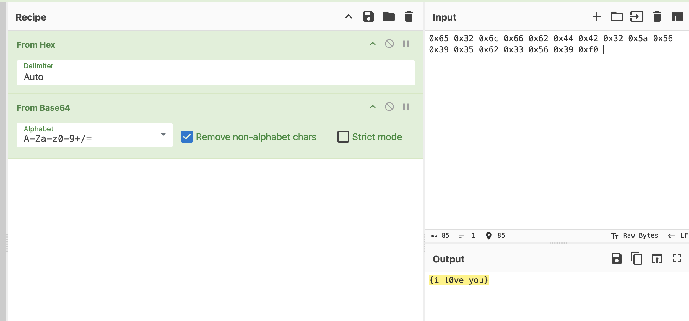

```cpp
#include <iostream>
using namespace std;

int main(void) {
    unsigned char Str2[17] = {
        0x65, 0x33, 0x6E, 0x69, 0x66, 0x49, 0x48, 0x39, 0x62, 0x5F, 0x43, 0x40, 0x6E, 0x40, 0x64, 0x48,
    };
    for (int i = 0; i < sizeof(Str2) / sizeof(char); ++i) {
        Str2[i] -= i;
        printf("0x%02x ", Str2[i]);
    }
    putchar('\n');
    return 0;
}
```

