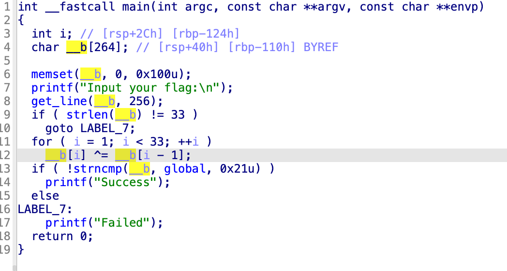

```cpp
#include <iostream>
using namespace std;

int main(void) {
    unsigned char aFKWOXZUPFVMDGH[34] = {
        0x66, 0x0A, 0x6B, 0x0C, 0x77, 0x26, 0x4F, 0x2E, 0x40, 0x11, 0x78, 0x0D, 0x5A, 0x3B, 0x55, 0x11,
        0x70, 0x19, 0x46, 0x1F, 0x76, 0x22, 0x4D, 0x23, 0x44, 0x0E, 0x67, 0x06, 0x68, 0x0F, 0x47, 0x32,
        0x4F, 0x00
    };
    for (int i = 33 - 1; i >= 0; --i) {
        aFKWOXZUPFVMDGH[i] ^= aFKWOXZUPFVMDGH[i - 1];
    }
    printf("%s\n", aFKWOXZUPFVMDGH);
    return 0;
}
```

编写对应的脚本得到最后的结果